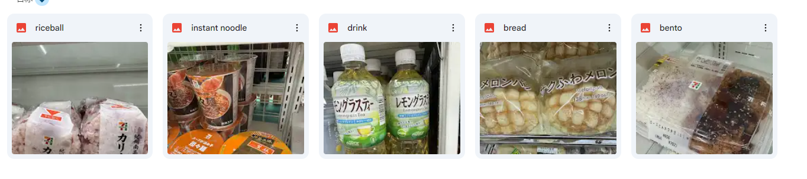
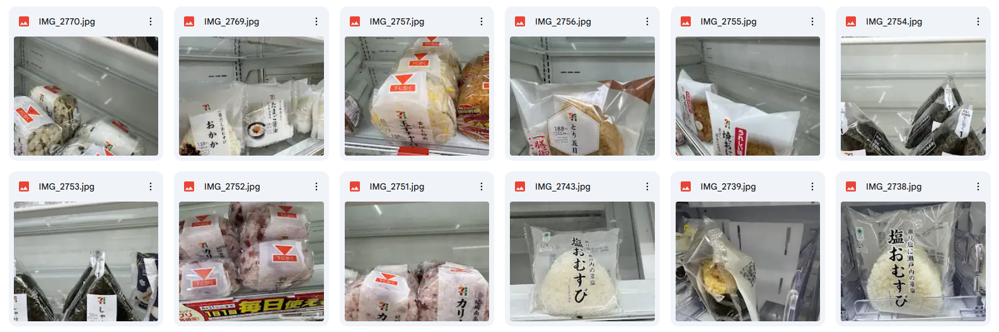
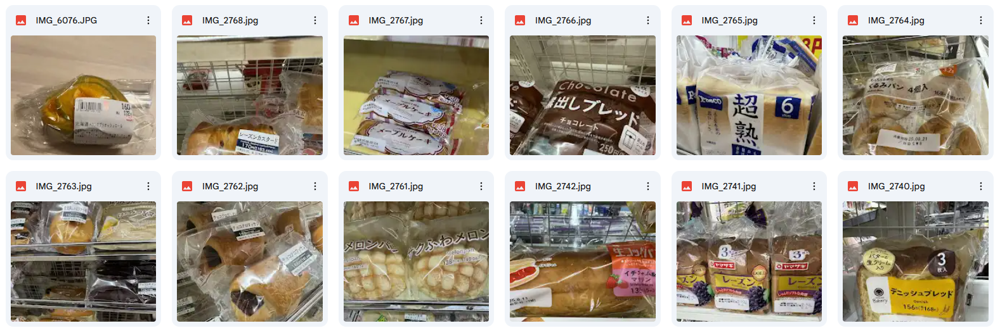
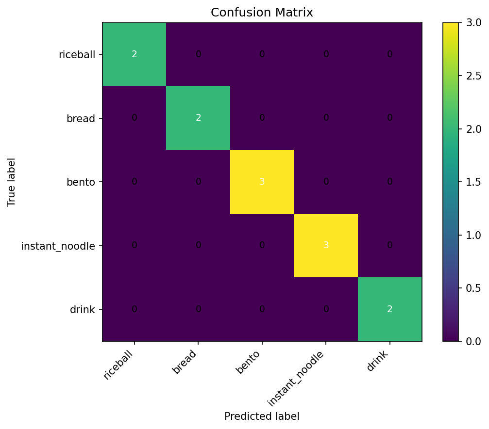

# **コンビニ食品分類モデル**

## **概要**

本プロジェクトは、PyTorch と ResNet50 を用いてコンビニ系の食品画像（おにぎり・パン・弁当・インスタント麺・飲み物）を5クラスに分類する。小規模データセットでも扱いやすいように、
データ拡張・転移学習（層の凍結）・混合精度学習・評価レポート出力までを一通り対応している。
   <div align="medium">
      
   </div>
##　**リポジトリ構成**
```bash
Food_Classification_ResNet50/
├── data/                 # 画像データセットのルートディレクトリ
├── logs/                 # 学習ログ・チェックポイント・TensorBoard 用ログなど
├── net/                  # ResNet50 ベースのモデル定義・ラッパーモジュール
├── result/               # 学習済みモデル、評価結果、混同行列やレポートの出力先
├── data_augmentation.py  # Albumentations を用いたデータ拡張（クラス別/デフォルトの変換）
├── data_loader.py        # FoodDataset と DataLoader の設定（学習/検証データの分割を含む）
├── train_val.py          # 1 エポック分の学習・検証ループ、損失と精度の計算処理
├── result_export.py      # 混同行列や classification report の保存・可視化を行うスクリプト
└── main.py               # エントリーポイント：データ読み込み〜学習・評価・結果出力まで一括実行
```
## 特徴

- **ResNet50バックボーンの食品分類モデル**
  - ImageNet事前学習済みResNet50を利用し、食品クラス向けに微調整（ファインチューニング）は可能。
- **5クラスのコンビニ食品分類タスクに特化**
  - riceball, bread, bento, instant_noodle, drinkの5クラスを想定したデータローダとクラス定義をしている。
- **クラスごとのデータ拡張パイプライン**
  - Albumentationsを用いて、クラスごとに異なる拡張（回転・ノイズ・ぼかし・色変換など）を適用している。
  - 汎用のdefault_transform も用意されているため、検証用や未指定クラスにも対応可能。
- **トレーニングループの実装が済んだ実験用テンプレート**
  - AdamW + CosineAnnealingLRによる最適化
  - torch.cuda.ampを用いた混合精度学習（GPU 使用時）
  - 検証精度が改善しない場合に学習を打ち切り（Early Stopping）
  - ベストモデルを自動で保存（logs/best_resnet50_food.pth）
- **評価指標の自動出力と可視化**
  - 検証データに対する予測から以下のファイルを自動生成し、result/の下に保存する。
     - Confusion Matrix（PNG画像&CSV）
     - classification report（テキスト&CSV）
     - クラス別のPrecision/Recallを記載したCSV
- **シンプルで拡張しやすいディレクトリ構成**
  - data/：画像データ
  - logs/：学習ログ・ベストモデル
  - result/：各種評価結果・レポート
  - net/：モデル定義（ResNet50 ラッパー）
  - data_augmentation.py / data_loader.pyで前処理とデータローダの分離

##　機能
- **データローディング&前処理**
  - FoodDatasetクラスで画像パスとラベルを管理し、クラスごとの拡張またデフォルト前処理を適用している。
  - train_test_splitで訓練/検証データを分割する。（stratify 付き）
- **モデル学習**
  - GPU/CPUを自動判定してデバイスを選択する。
  - ResNet50の一部層を凍結した転移学習を設定する。（freeze_upto）
  - 1エポックごとに損失と精度を計算し、学習・検証ログを出力する。
  - 検証精度が更新されたときだけ重みを保存し、最終的にベストモデルをロードして評価に使用する。

- **評価&レポート生成**
  - result_export.evaluate_and_reportにより、以下のレポートを自動生成・保存する。
     - Confusion Matrix（生/正規化）
     - Classification Report（マクロ/ マイクロ/重み付きなど）
     - クラス別Precision/Recall

## 学習フロー

1. **リポジトリを取得する**
   ```bash
   git clone https://github.com/Wangjx1995/Food_Classification_ResNet50.git
   cd Food_Classification_ResNet50
   ```

2. **環境を構築する**
   - Python3.8以上と、以下のライブラリを用意する：PyTorch、torchvision、numpy、pandas、tqdm、pillow、opencv-python、matplotlib、tensorboard（任意）  
   - 例：
     ```bash
     pip install torch torchvision torchaudio
     pip install numpy pandas tqdm pillow opencv-python matplotlib tensorboard
     ```

3. **データセットを用意する**
   - 以下のようなディレクトリ構成で画像を配置する：  
     ```text
     data/
     ├─ train/
     │  ├─ class_a/
     │  ├─ class_b/
     │  └─ ...
     └─ val/
        ├─ class_a/
        ├─ class_b/
        └─ ...
     ```
   - `class_a` などのフォルダ名が、そのままクラス名（ラベル）として使われる。
   本プロジェクトは、五つのクラスのデータを用意した、分類モデルを学習した。以下は、データセットの一部抜粋。
   <div align="medium">
      
   </div>
      <div align="medium">
      
   </div>

4. **ベースライン学習を実行する**
   - まずはデフォルト設定のまま 1 回学習して、動作を確認する：  
     ```bash
     python main.py
     ```
   - result/配下に評価レポート・混同行列の出力を確認できる。
5. **コードリーディング**
   - おすすめの読む順番：
     1. `main.py`：引数、学習フロー全体の流れ
     2. `data_loader.py`：データセット構造と `DataLoader` の周り
     3. `data_augmentation.py`：画像前処理・データ拡張のプロセス
     4. `net/`：ResNet50ベースのモデル定義と転移学習の設定
     5. `train_val.py`：1エポック分の学習・検証ループ
     6. `result_export.py`：評価指標・混同行列の出力

6. **発展・応用**
   - クラス数やクラス名を変更して、自前データセットに対応させる
   - `--freeze_upto` を変えて、どこまでの層を凍結するか比較する（転移学習の挙動を学ぶ）  
   - データ拡張やハイパーパラメータ（学習率・エポック数・バッチサイズなど）を変えて精度と学習安定性を比較する  
   - 必要に応じて、新しいネットワーク構造を `net/` に追加して試してみる

## 学習結果

以下の混同行列ように、精度100％で五つのクラスの食品を分類することができた。
   <div align="medium">
      
   </div>
